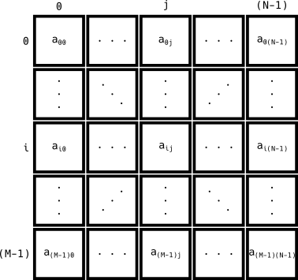

## MATRIX

The element A has dimensions **M x N**.

Conceptually, the element A is a **matrix** with *M rows* and *N elements*.

 

i ==> letter used as an index to access *complete rows*.
j ==> letter used as an index to access the *elements in a row*.

 

In practice, the element A is list of
M lists with
N elements
(There are N elements in M lists in a list)

The term **A[i]** represents the row (list) with index *i*, with *N* elements.

The term **A[i,j] :=: a_{ij}** represents the element with index *j* in the row (list) *i*.

## TENSORS (TENSORFLOW, PYTORCH, ...) AND ARRAYS (NUMPY)

The element A has dimensions **M x N X P**.

Conceptually, the element A is a **matrix** with *M rows* and *N cells* and *P components*.

